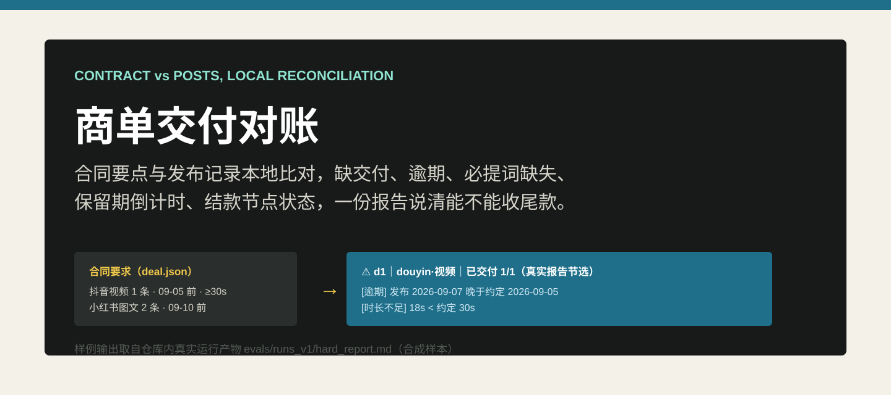
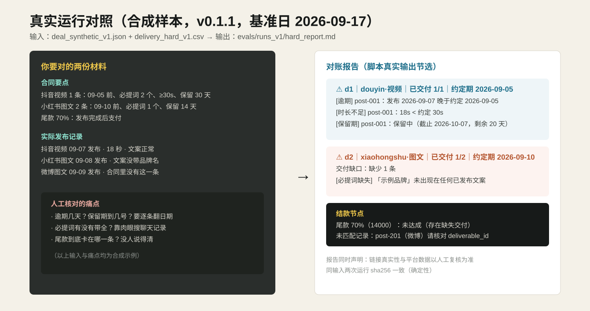
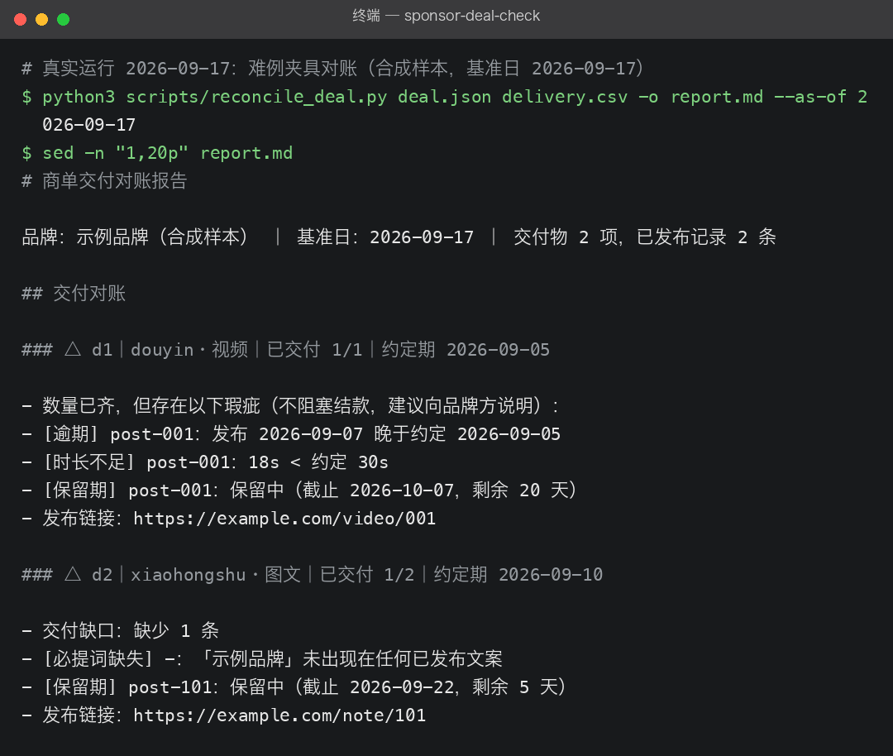
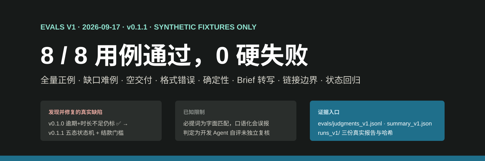

# 商单交付对账 sponsor-deal-check

  

商单做完了，尾款却总卡在"双方对不上"：哪条逾期、必提词漏没漏、保留期到几号、
结案材料缺哪样——靠翻聊天记录逐条核，一单半天。把合同要点和发布记录交给本工具，
秒级输出一份**状态诚实的对账报告**。全部本地比对，不上传任何第三方，不需要平台授权。

## 使用场景

这个工具用在商单从**交付完成到收到尾款**之间的四次核对上：

| 场景 | 你是谁 | 什么时候用 | 对账报告帮你干什么 |
| --- | --- | --- | --- |
| 交稿后、申请尾款前自查 | 接商单的个人博主 | 内容全部发完，准备发"尾款结算申请" | 先自己跑一遍：漏交付、必提词漏带、逾期、时长不足一次看清，别被品牌方验收打回再来回改 |
| 回应品牌方验收意见 | 个人博主 / 工作室 | 品牌方说"你们有条款没执行"但说不清哪条 | 逐条列出每个交付物的状态与瑕疵明细，拿报告说话，该补的补、该解释的解释 |
| 保留期盯梢 | 个人博主 | 合同写了"发布后保留 30/60 天"，想确认什么时候才能删 | 每条已发布内容都算好保留期截止日和剩余天数，到期前不会误删 |
| 多达人多单批量核对 | MCN 商务 / 签约工作室 | 每月验收季，几十个单子要结案 | 一个商单一组 `deal.json + delivery.csv`，逐单出报告；结案材料清单（链接、数据截图、验收记录）自动生成，漏项直接卡住"尾款未达成" |

不适合的场景：直播实时监测、竞品数据分析、税务与违约金计算——它只做"合同要求 vs 发布记录"的文本与日期比对。

## 它解决什么问题

MCN 每接一单都重新搭一张表格，海外已有 Sponsorship Manager 等 SaaS 验证了品类，
但表格模板只**记录**不**比对**，SaaS 要把商务数据上传第三方。本仓库只做那一步：
**合同要求 vs 实际发布的自动核对**。

  

上图取自仓库内真实运行产物（[输入夹具](evals/fixtures/delivery_hard_v1.csv) →
[对账报告](evals/runs_v1/hard_report.md)，人工编写的合成样本）：逾期和时长不足逐条列出、
交付缺口与必提词缺失明示、微博上多发的记录提示核对、尾款节点直接给出"未达成"。
下面是同一运行的真实终端截图：

  

## 能力与边界

| 能力 | 边界 |
| --- | --- |
| 五态状态机：✅ 合规 / ⚠️ 有瑕疵 / ⛔ 验收阻塞 / ⚠️ 不足额 / ❌ 未交付 | 只做文本与日期比对，链接真伪需人工复核 |
| 逐条列出逾期、必提词缺失、时长不足、保留期倒计时 | 必提词为字面匹配，口语化带出会误报，需人工确认 |
| 结款节点自动判定（数量与验收阻塞项是否满足） | 不做税务与法律判断，违约条款请咨询专业人士 |
| 纯 Python 标准库，离线运行，同输入结果一致 | 合同原件含敏感条款，deal.json 请勿公开 |

## 如何安装与使用

把本仓库放入你的 Agent 技能目录，然后直接对 Agent 说：

> "这是品牌方发来的合作要点和我的发布记录，帮我对一下账，看尾款还差哪些条件。"

Agent 会把合同要点转写成结构化清单（给你确认），运行对账脚本，再逐条解释每个缺口
的验收影响与补救动作。也可以只用命令行脚本，参数见[维护文档](docs/usage.md)。

输入材料：合同要点（JSON 结构，字段见[字段定义](references/deal-schema.md)）和一份发布记录 CSV。
日期比对基于"基准日"，复现评测时固定该日期。

## 评测结果

V1 评测（2026-09-17，v0.1.2，全部使用合成夹具、固定基准日 2026-09-17）：
**8/8 用例通过，0 硬失败**。覆盖全量正例、缺口难例、空交付、格式错误、确定性
（两次运行 sha256 一致）、合同要点转写、链接边界声明与状态机回归八类行为。

  

- 逐题判断：[judgments_v1.jsonl](evals/judgments_v1.jsonl)；汇总：[summary_v1.json](evals/summary_v1.json)
- 真实产物与哈希：[evals/runs_v1/](evals/runs_v1/)
- **诚实披露**：v0.1.0 曾把"数量齐但逾期+时长不足"的交付标成 ✅（人工检查报告时发现），
  v0.1.1 升级为五态状态机并让验收阻塞项卡住结款条件；v0.1.2 在为 README 截图审查时又发现
  WARN 行输出"交付缺口：缺少 0 条"的措辞缺陷并修复，过程见[迭代记录](evals/iteration_notes.md)；
  判定为开发 Agent 自评（model_only），尚未独立人工复核。

## 对标与定位

与飞书/Notion 商单表格模板、Sponsorship Manager 等 SaaS、结案代做服务的定位对比，
以及"本地比对、状态诚实、不越权"的立场，见[对标文档](references/benchmarks.md)。

需求来源：医疗与自媒体需求雷达对公开信号的研究（problem_key `sponsor-deliverable-reconciliation`，
4 条独立来源证据，雷达排序第 1）。

## 社区与许可

- 社区讨论：[LINUX DO](https://linux.do)
- 许可证：Apache License 2.0（见 [LICENSE](LICENSE)，第三方素材说明见 [NOTICE](NOTICE)）
